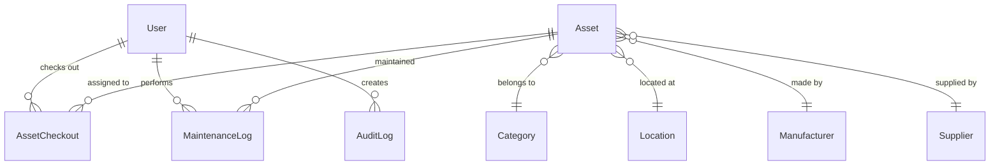

<p align="center">
  
  
  
  
  
</p>

# 🏥 MedAsset — Hệ thống Quản lý Thiết bị Bệnh viện

**MedAsset** là ứng dụng web quản lý thiết bị và vật tư y tế cho bệnh viện, lấy cảm hứng từ [Snipe-IT](https://snipeitapp.com/). Hệ thống giúp theo dõi máy MRI, X-quang, CT Scanner, máy tính, máy in và các thiết bị y tế khác với giao diện hiện đại, phân quyền đầy đủ và hỗ trợ xuất báo cáo.

---

## ✨ Tính năng chính

| Tính năng | Mô tả |
|---|---|
| 📊 **Dashboard** | Thống kê tổng quan với biểu đồ tròn, biểu đồ cột, hoạt động gần đây |
| 📦 **Quản lý Thiết bị** | CRUD đầy đủ, tìm kiếm, lọc theo trạng thái/danh mục/vị trí, phân trang |
| 🔄 **Cấp phát / Thu hồi** | Checkout/Checkin thiết bị cho nhân viên, lưu lịch sử |
| 📁 **Danh mục** | Phân loại thiết bị (MRI, X-quang, máy in, máy tính...) |
| 📍 **Vị trí** | Quản lý khoa/phòng (Khoa Nội, Phòng IT, Phòng Mổ...) |
| 🏭 **Nhà sản xuất** | Siemens, GE Healthcare, Philips, Canon, HP, Dell... |
| 🔧 **Bảo trì** | Theo dõi phiếu bảo trì (phòng ngừa, sửa chữa, kiểm tra) |
| 📋 **Báo cáo** | Xuất Excel (.xlsx) và CSV, lọc theo nhiều tiêu chí |
| 👥 **Người dùng** | Quản lý tài khoản, phân quyền 3 cấp |
| 🔐 **Phân quyền** | Admin / Manager / Staff với middleware bảo vệ route |
| 📝 **Nhật ký** | Audit log ghi lại mọi hoạt động trên hệ thống |
| 🌙 **Dark Mode** | Giao diện tối hiện đại với glassmorphism |
| 🇻🇳 **Tiếng Việt** | Toàn bộ UI bằng tiếng Việt |

---

## 🛠️ Công nghệ sử dụng

| Thành phần | Công nghệ |
|---|---|
| Framework | [Next.js 15](https://nextjs.org/) (App Router) |
| Ngôn ngữ | [TypeScript 5](https://www.typescriptlang.org/) |
| Database | [SQLite](https://www.sqlite.org/) (qua [Prisma ORM](https://www.prisma.io/)) |
| Authentication | [NextAuth.js](https://next-auth.js.org/) (Credentials + JWT) |
| Styling | [Tailwind CSS v4](https://tailwindcss.com/) |
| Charts | [Recharts](https://recharts.org/) |
| Icons | [Lucide React](https://lucide.dev/) |
| Export | [SheetJS (xlsx)](https://docs.sheetjs.com/) |

---

## 🚀 Cài đặt & Chạy

### Yêu cầu

- [Node.js](https://nodejs.org/) >= 18.0
- npm hoặc yarn

### Bước 1: Clone repo

```bash
git clone https://github.com/YOUR_USERNAME/medasset.git
cd medasset
```

### Bước 2: Cài dependencies

```bash
npm install
```

### Bước 3: Cấu hình môi trường

```bash
cp .env.example .env
# Sửa .env nếu cần (mặc định đã sẵn sàng chạy)
```

### Bước 4: Tạo database & nạp dữ liệu mẫu

```bash
npm run db:setup
```

> Lệnh này sẽ tạo file `prisma/dev.db` (SQLite) và nạp dữ liệu mẫu gồm 18 thiết bị, 10 danh mục, 8 vị trí...

### Bước 5: Chạy ứng dụng

```bash
npm run dev
```

Mở trình duyệt tại **http://localhost:3000**

---

## 🔑 Tài khoản Demo

| Vai trò | Email | Mật khẩu | Quyền hạn |
|---|---|---|---|
| 🔴 Admin | `admin@hospital.vn` | `admin123` | Toàn quyền (quản lý user, audit log) |
| 🟡 Manager | `manager@hospital.vn` | `manager123` | CRUD thiết bị, danh mục, báo cáo |
| 🟢 Staff | `staff@hospital.vn` | `staff123` | Xem thiết bị, xem dashboard |

---

## 📂 Cấu trúc dự án

```
medasset/
├── prisma/
│   ├── schema.prisma       # Database schema (9 models)
│   ├── seed.ts              # Dữ liệu mẫu
│   └── dev.db               # SQLite database file (auto-generated)
├── src/
│   ├── app/
│   │   ├── api/             # 16+ REST API routes
│   │   │   ├── assets/      # CRUD + checkout/checkin
│   │   │   ├── categories/  # CRUD
│   │   │   ├── locations/   # CRUD
│   │   │   ├── manufacturers/ # CRUD
│   │   │   ├── users/       # CRUD (Admin)
│   │   │   ├── maintenance/ # Bảo trì
│   │   │   ├── reports/     # Xuất Excel/CSV
│   │   │   ├── audit-logs/  # Nhật ký
│   │   │   └── dashboard/   # Thống kê
│   │   ├── login/           # Trang đăng nhập
│   │   └── (dashboard)/     # Các trang chính (protected)
│   │       ├── page.tsx     # Dashboard
│   │       ├── assets/      # Thiết bị (list/new/edit/detail)
│   │       ├── categories/  # Danh mục
│   │       ├── locations/   # Vị trí
│   │       ├── manufacturers/ # Nhà sản xuất
│   │       ├── users/       # Người dùng
│   │       ├── maintenance/ # Bảo trì
│   │       ├── reports/     # Báo cáo
│   │       └── audit-log/   # Nhật ký
│   ├── components/          # UI components (Sidebar, AuthProvider)
│   ├── lib/                 # Utilities (auth, prisma, utils, audit)
│   └── types/               # TypeScript declarations
├── .env.example             # Mẫu cấu hình
├── package.json
└── README.md
```

---

## 📊 Database Schema



Database sử dụng **SQLite** — không cần cài đặt database server riêng. File database nằm tại `prisma/dev.db`, được tạo tự động khi chạy `npm run db:setup`.

---

## 📜 Scripts

| Script | Mô tả |
|---|---|
| `npm run dev` | Chạy dev server (http://localhost:3000) |
| `npm run build` | Build production |
| `npm run start` | Chạy production server |
| `npm run db:setup` | Tạo database + nạp dữ liệu mẫu |
| `npm run db:generate` | Generate Prisma Client |
| `npm run db:push` | Đẩy schema lên database |
| `npm run db:seed` | Nạp dữ liệu mẫu |
| `npm run db:studio` | Mở Prisma Studio (GUI quản lý DB) |

---

## 📄 License

MIT License — Sử dụng tự do cho mục đích thương mại và phi thương mại.
